# Walmart retail pipeline — CDC to BI

An end-to-end batch pipeline that lands raw retail data, turns change data capture into typed
silver and gold tables, and keeps history for every dimension. Airflow 3 orchestrates, dbt-core
with the Databricks adapter transforms, and Databricks Unity Catalog holds everything the BI
layer reads.

The pipeline runs on a daily schedule, **11:00 America/Sao_Paulo**, and is deliberately
sequential: each layer starts only after the previous one passed its tests.



---

## Contents

- [At a glance](#at-a-glance)
- [Repository layout](#repository-layout)
- [Stage 0 — bootstrap the raw layer](#stage-0--bootstrap-the-raw-layer)
- [Stage 1 — bronze, the CDC landing zone](#stage-1--bronze-the-cdc-landing-zone)
- [Stage 2 — silver tech](#stage-2--silver-tech)
- [Stage 3 — silver biz, one wide table](#stage-3--silver-biz-one-wide-table)
- [Stage 4 — gold, dimensions and fact](#stage-4--gold-dimensions-and-fact)
- [The daily DAG](#the-daily-dag)
- [Schema naming](#schema-naming)
- [Data quality](#data-quality)
- [Running it](#running-it)
- [Configuration reference](#configuration-reference)
- [Known issues and next steps](#known-issues-and-next-steps)
- [Glossary](#glossary)

---

## At a glance

| | |
|---|---|
| **Orchestrator** | Apache Airflow 3.3.2 (Astro Runtime image `3.3-8`) |
| **Transformation** | dbt-core ≥ 1.12.5 + dbt-databricks ≥ 1.12.6, `dbt_utils` 1.4.1 |
| **Warehouse** | Databricks Unity Catalog, catalog `walmart` |
| **Landing** | Google Cloud Storage `gs://walmart-dataset1` + BigQuery `walmart_db` |
| **Schedule** | `0 11 * * *`, `catchup=False`, timezone `America/Sao_Paulo` |
| **DAGs** | `csv_to_bigquery_improved` (one-off) and `orchestrate_improved` (daily) |
| **Data volume** | 12 796 source rows in, ~300 500 rows out at the fact grain |

```
   CSV files                 GCS raw/            BigQuery          Databricks
  ┌───────────┐            ┌──────────┐       ┌──────────┐      ┌──────────┐
  │ 6 tables  │ ─stage 0─► │  6 blobs │ ────► │ walmart_db│ ─┐   │  bronze  │ ─stage 1─►
  └───────────┘            └──────────┘       └──────────┘  └─► └──────────┘
                                    one-off, manual trigger      daily CDC job
                                                                        │
                     ┌──────────────────────────────────────────────────┘
                     ▼
   silver_tech            silver_biz              gold
  ┌──────────────┐      ┌───────────┐      ┌────────────────────────┐
  │ 6 incremental│ ───► │  obt_biz  │ ───► │ 5 × dim_*  (SCD2)      │
  │ models, merge│      │  6 joins  │      │ 1 × fact_orders        │
  └──────────────┘      └───────────┘      └────────────────────────┘
   stage 2                stage 3               stage 4
```

Row counts below assume a full load from the CSVs in `include/walmart_dataset/data/`.

| Source table | Rows | Source table | Rows |
|---|---:|---|---:|
| `orders` | 10 000 | `products` | 500 |
| `order_items` | 30 021 | `employees` | 250 |
| `customers` | 2 000 | `stores` | 25 |

---

## Repository layout

```
.
├── dags/                          Airflow DAGs
│   ├── csv_to_bigquery DAG      →  insert_data_improved.py   (stage 0, manual)
│   ├── orchestrate DAG          →  orchestrate_improved.py   (daily, 9 tasks)
│   └── ...originals...         →  insert_data.py, orchestrate.py
│
├── walmart/                       the dbt project (DBT_PROJECT_DIR)
│   ├── dbt_project.yml            materialisation + schema per folder
│   ├── profiles.yml               Databricks connection via env vars
│   ├── packages.yml               dbt-labs/dbt_utils 1.4.1
│   ├── macros/custom_schema.sql   schema naming without the target prefix
│   ├── models/
│   │   ├── source/sources.yml     the walmart.bronze source
│   │   ├── silver_tech/           6 incremental models + properties.yml
│   │   ├── silver_biz/obt_biz.sql the business wide table
│   │   └── gold/
│   │       ├── ephemeral/         5 inlined models, no tables
│   │       └── fact/fact_orders.sql
│   ├── snapshots/                 5 SCD2 snapshots, YAML config
│   └── tests/test_obt.sql         singular test on obt_biz keys
│
├── include/walmart_dataset/
│   ├── data/*.csv                 seed data, 6 files
│   └── ddl/walmart_schema.sql     standalone DDL, used by the older DAG only
│
├── docs/diagrams/                 the animated SVGs used by this README
├── Dockerfile                     Astro Runtime base image
├── pyproject.toml                 dependencies
└── airflow_settings.yaml          local-only connections, pools, variables
```

---

## Stage 0 — bootstrap the raw layer


**DAG:** `csv_to_bigquery_improved` · **schedule:** `None` (manual trigger only)

This DAG exists to get the seed CSVs off the developer's laptop and into the cloud. It runs once
at project setup, and again whenever the seed data changes.

Flow, as declared in `dags/insert_data_improved.py`:

1. **`check_local_files`** — a plain-Python TaskFlow step that verifies all six CSVs exist before
   anything is created in the cloud. Cheap fail-fast beats a half-provisioned project.
2. **`create_bucket` ∥ `create_dataset`** — both idempotent and independent, so they run in
   parallel. `gs://walmart-dataset1` in `us-east1`, dataset `walmart_db` in the `US` multi-region
   so it can read a bucket in any US region.
3. **Six TaskGroups, one per table** — `upload` → `load` → `check_not_empty`, all six running
   concurrently. Each table gets its own logs and its own retries.

Design points worth knowing:

- **One schema definition, no separate DDL.** The Python `SCHEMAS` dict is the single source of
  truth. Each `GCSToBigQueryOperator` creates its own table with `create_disposition="CREATE_IF_NEEDED"`,
  so `include/walmart_dataset/ddl/walmart_schema.sql` is only used by the older
  `insert_data.py` DAG and no longer has to be kept in sync.
- **Reruns are safe.** `write_disposition="WRITE_TRUNCATE"` replaces the table instead of
  appending, and `max_active_runs=1` stops two runs racing each other.
- **The worker is not held hostage.** `deferrable=True` on the load tasks releases the worker slot
  while BigQuery works.
- **Empty tables fail loudly.** `BigQueryCheckOperator` with `SELECT COUNT(*)` returns `0`, which is
  falsy, so a load that reports success but writes nothing still fails the DAG.

---

## Stage 1 — bronze, the CDC landing zone

The dbt source is declared in `walmart/models/source/sources.yml`:

```yaml
sources:
  - name: walmart
    database: walmart
    schema: bronze
    tables: [customers, employees, order_items, orders, products, stores]
```

Bronze is filled by a **Databricks job, `722339675985031`**, triggered by
`DatabricksRunNowOperator(deferrable=True)`. Airflow does not move the data here; it hands the
work to Databricks and waits without occupying a worker slot.

> **The seam is outside this repository.** Stage 0 writes to BigQuery `walmart_db`, and the dbt
> source reads from Databricks `walmart.bronze`. The step that moves data between those two places
> is not in this repo — it lives in the Databricks job definition or in a copy step somewhere else.
> If you are picking this project up, that is the first thing to go and confirm.

Bronze tables are raw copies: every row keeps `created_timestamp`, `updated_timestamp` and
`is_active`, which is what makes the incremental pattern in stage 2 possible.

---

## Stage 2 — silver tech


Six models, one per source table, all **incremental** and all following the same pattern
(`walmart/models/silver_tech/orders_tech.sql` and its five siblings):

```sql
{{ config(unique_key='order_id') }}

SELECT *, current_timestamp() AS processed_at
FROM {{ source('walmart', 'orders') }}


WHERE updated_timestamp > (SELECT COALESCE(MAX(updated_timestamp), '1900-01-01') FROM {{ this }})

```

What this buys you:

- **First run** builds the whole table; `is_incremental()` is false, so there is no `WHERE` clause.
- **Later runs** read the watermark `MAX(updated_timestamp)` already stored, keep only rows past
  it, and merge on the natural key. With a `unique_key` set, dbt-databricks issues a `MERGE`
  rather than an append, so an overlapping window cannot double rows.
- **`processed_at`** records when silver last touched the row. It is an audit column, not a
  business timestamp — use the source `updated_timestamp` for anything reported to users.

`walmart/models/silver_tech/properties.yml` adds `not_null` and `unique` on all six natural keys,
which is both a real data contract and the precondition for `MERGE` doing the right thing.

What the pattern does **not** do is documented in
[Known issues](#known-issues-and-next-steps) — no deletes, a strict `>` boundary, and no
`is_active` filtering.

---

## Stage 3 — silver biz, one wide table


`walmart/models/silver_biz/obt_biz.sql` is a single wide business table built from a **Jinja list
of six configs** rather than a hand-written join list. Each entry declares its table, its column
block, its alias and how it attaches:

| Alias | Model | Join condition | Effect |
|---|---|---|---|
| `o` | `orders_tech` | base table, no join | grain of the result |
| `c` | `customers_tech` | `o.customer_id = c.customer_id` | many to one |
| `oi` | `order_items_tech` | `o.order_id = oi.order_id` | **grain change, ×3** |
| `p` | `products_tech` | `oi.product_id = p.product_id` | many to one |
| `e` | `employees_tech` | `o.store_id = e.store_id` | **fans out, ~×10** |
| `s` | `stores_tech` | `o.store_id = s.store_id` | many to one |

Two loops then assemble the SQL: one concatenates the column blocks with a prefixed alias per
column, the other emits the base table plus `LEFT JOIN` for everything after it. Because every
config after the first is a `LEFT JOIN`, no order is ever dropped because a dimension is missing.

The payoff is that adding a column, a table or an audit stamp is a dictionary edit, and the
`customer_`, `order_`, `product_` prefixes mean downstream models can select columns without
guessing which table they came from.

**The cost is a 10× row explosion.** An order has a store, and a store has 4 to 18 employees in
the seed data, so every order line is repeated once per employee in that store:

```
30 021 order lines  ×  ~10 employees per store  ≈  300 513 obt_biz rows
```

`total_amount` and `line_amount` are therefore duplicated about ten times. Summing them in
`fact_orders` inflates revenue roughly tenfold. This is not a bug you can fix by adding a test
afterwards — see [Known issues](#known-issues-and-next-steps).

---

## Stage 4 — gold, dimensions and fact


Gold is built in two moves.

**Dimensions first.** Five snapshots, one per entity, each fed by a matching **ephemeral** model:

```yaml
snapshots:
  - name: dim_customers
    relation: ref('eph_customers')
    config:
      schema: gold
      database: walmart
      unique_key: customer_id
      strategy: timestamp
      updated_at: customer_updated_timestamp
      dbt_valid_to_current: "to_date('9999-12-31')"
```

Three details are doing real work here:

- `relation: ref('eph_customers')` instead of `sql:` — this is the supported way to snapshot an
  existing model, and it is **the only reason the ephemeral layer exists**. Ephemeral models are
  never tables; dbt inlines their SQL into whatever reads them. Here, the snapshot.
- `strategy: timestamp` compares the incoming `updated_at` against the stored one. A newer value
  closes the open version by writing its timestamp into `dbt_valid_to`, then inserts a new version
  row. Result: SCD type 2, with `dbt_valid_from` / `dbt_valid_to` bounding each version and exactly
  one open row per key.
- `dbt_valid_to_current` replaces the usual `NULL` on open rows with the sentinel
  `9999-12-31`. Downstream joins and BI date filters get simpler; the cost is a Databricks-specific
  expression that will not port to another warehouse unchanged.

**Then the fact.** `fact_orders` is a plain `table` selecting the six keys and five measures from
`obt_biz`. It inherits the row grain of `obt_biz` — it does not join the dimensions, and it has no
incremental logic yet.

---

## The daily DAG


**DAG:** `orchestrate_improved` · **schedule:** `0 11 * * *` · **catchup:** `False`

Nine tasks, one `chain()`, no branching:

| # | Task | Runs | Gate after it? |
|---|---|---|---|
| 1 | `ingest_cdc` | Databricks job `722339675985031`, deferrable | — |
| 2 | `source_freshness` | `dbt source freshness` | yes, by failing the chain |
| 3 | `run_silver_tech` | `dbt run --select silver_tech` | — |
| 4 | `test_silver_tech` | `dbt test --select silver_tech` | **yes** |
| 5 | `run_silver_biz` | `dbt run --select silver_biz` | — |
| 6 | `test_silver_biz` | `dbt test --select silver_biz` | **yes** |
| 7 | `run_gold_eph` | `dbt run --select gold/ephemeral` | — |
| 8 | `run_gold_dim` | `dbt snapshot` | — |
| 9 | `run_gold_fact` | `dbt run --select gold/fact` | — |

Each task is a `BashOperator` built by a small local helper:

```python
def dbt(task_id: str, command: str) -> BashOperator:
    # DBT_PROJECT_DIR and DBT_PROFILES_DIR come from .env, so no `cd` is needed
    return BashOperator(task_id=task_id, bash_command=f"dbt {command}")
```

Because `DBT_PROJECT_DIR` and `DBT_PROFILES_DIR` both point at `/usr/local/airflow/walmart`, the
dbt project has to be mounted there. The older `orchestrate.py` instead hardcodes
`cd /usr/local/airflow/walmart` in each command.

Two things about the chain are worth flagging honestly:

- **Task 7 is a no-op.** `dbt run --select gold/ephemeral` materialises nothing, because ephemeral
  models are only ever inlined into their readers. The real dimension work happens in task 8,
  where `dbt snapshot` compiles the ephemeral models into each snapshot. The task is harmless but
  it is not doing what its name implies.
- **`dbt snapshot` is unselected.** It builds all five dimensions, which is correct today, and will
  quietly keep building all five the day a sixth one appears.

---

## Schema naming

`walmart/macros/custom_schema.sql` overrides `generate_schema_name` to drop dbt's usual
`target_schema_custom_schema` concatenation:

```sql

    
    
        {{ default_schema }}
    
        {{ custom_schema_name | trim }}
    

```

Combined with `dbt_project.yml`, tables land exactly where `sources.yml` expects them:

| Folder | `+schema` | Materialisation | Result |
|---|---|---|---|
| `models/silver_tech` | `silver_tech` | `incremental` | 6 MERGE-on-key tables |
| `models/silver_biz` | `silver_biz` | `table` | 1 wide table, rebuilt daily |
| `models/gold/ephemeral` | `gold` | `ephemeral` | no tables, inlined only |
| `models/gold/fact` | `gold` | `table` | 1 star-schema fact |

---

## Data quality


Five checks stand between the CSVs and gold:

| Gate | Asserts | Severity |
|---|---|---|
| `check_not_empty` | `COUNT(*) > 0` for each of the six tables | error |
| `source freshness` | nothing — the source has no `loaded_at_field` | **not configured** |
| `not_null` + `unique` | every natural key in `silver_tech` is present and unique | error |
| `expression_is_true` | `products_tech.price > 0` | error |
| `test_obt` | no NULL surrogate key in `obt_biz` | warn |

Two of these are not doing what they appear to:

- **`source freshness` has nothing to check.** dbt needs a `loaded_at_field` or a `loaded_at_query`
  to compute freshness. `sources.yml` declares neither, so add `loaded_at_field: updated_timestamp`
  plus a `freshness:` block, or drop the task from the chain.
- **`expression_is_true` is stricter than its comment claims.** In `properties.yml` both
  `error_if: "> 0"` and `warning_if: "> 0"` are set. The recognised dbt arguments are `error_if`
  and `warn_if`; `warning_if` is not one of them and is swallowed. The test therefore runs with
  `error_if` alone — error severity, failing on any non-positive price.

And the gap that matters most: **nothing tests the gold layer at all.** `fact_orders` and the five
dimensions build with no assertions behind them.

---

## Running it

### Locally

```bash
astro dev start                 # or docker compose up, if you have an equivalent setup
```

Before the first run, create the Airflow connections. Either through the UI (Admin → Connections)
or by filling in `airflow_settings.yaml` for local-only development:

| Connection | Type | Used by |
|---|---|---|
| `gcp` | Google Cloud, service account JSON | all BigQuery and GCS operators |
| `databricks` | Databricks, token | `DatabricksRunNowOperator` |

Then trigger stage 0 manually from the Airflow UI — `csv_to_bigquery_improved` is the only DAG
with no schedule. Once `walmart.bronze` is populated, `orchestrate_improved` will do the rest on
its 11:00 schedule.

### dbt directly

```bash
cd walmart
export DBT_PROJECT_DIR=$PWD DBT_PROFILES_DIR=$PWD

dbt source freshness
dbt run  --select silver_tech
dbt test --select silver_tech
dbt run  --select silver_biz
dbt test --select silver_biz
dbt run  --select gold/ephemeral
dbt snapshot
dbt run  --select gold/fact

dbt docs generate   # lineage graph
```

`profiles.yml` reads its host, HTTP path and token from environment variables, so nothing
sensitive is committed:

```yaml
walmart:
  outputs:
    dev:
      catalog: walmart
      host: "{{ env_var('DATABRICKS_HOST') }}"
      http_path: "{{ env_var('DATABRICKS_HTTP_PATH') }}"
      token: "{{ env_var('DATABRICKS_TOKEN') }}"
      schema: dbt_schema
      threads: 10
      type: databricks
  target: dev
```

### DAG integrity tests

```bash
pytest tests/            # import errors, tags, and retries >= 2 on every DAG
```

---

## Configuration reference

Environment variables, from `.env` (git-ignored):

| Variable | Value | Purpose |
|---|---|---|
| `DATABRICKS_HOST` | workspace host, **no** `https://` prefix | `profiles.yml` |
| `DATABRICKS_HTTP_PATH` | SQL warehouse HTTP path | `profiles.yml` |
| `DATABRICKS_TOKEN` | personal access token | `profiles.yml` |
| `DBT_PROJECT_DIR` | `/usr/local/airflow/walmart` | dbt CLI, replaces `cd` |
| `DBT_PROFILES_DIR` | `/usr/local/airflow/walmart` | dbt CLI |
| `GOOGLE_APPLICATION_CREDENTIALS` | `/usr/local/airflow/include/gcp/service_account.json` | GCP operators |

`.gitignore` excludes `**/profiles.yml`, `**/service_account.json` and `.env`, so credentials
never reach the repository.

---

## Known issues and next steps

Honest list of what I would change, roughly in priority order.

### 1. The employee join multiplies the fact — the big one

`obt_biz` joins `employees` on `o.store_id = e.store_id`. An order has a store; a store has
employees; an order has no employee. So every order line repeats once per employee in its store,
turning 30 021 lines into 300 513 rows, and `total_amount` and `line_amount` end up duplicated
about ten times.

`fact_orders` inherits that grain, so `SUM(total_amount)` over it reports roughly ten times the
real revenue. Either:

- drop `employees` from `obt_biz` and reach the attribute through `dim_employees` plus a real
  bridge, or
- if the attribution genuinely is "whoever was on shift", make the join explicit about that with a
  bridge table carrying its own grain and its own tests.

Either way, add a test that asserts the fact grain. A row-count reconciliation between
`obt_biz` and `SUM(order_items.quantity)` would have caught this on day one.

### 2. Both DAG pairs are live

`dags/` contains `insert_data.py` / `insert_data_improved.py` and `orchestrate.py` /
`orchestrate_improved.py`. All four are discovered by the scheduler. `orchestrate` and
`orchestrate_improved` both carry `schedule="0 11 * * *"`, so **the daily pipeline currently runs
twice**. Delete or rename the superseded pair, or move them out of `dags/`.

### 3. `dbt snapshot` runs unselected

It builds all five dimensions. Add `--select` when the set is still small enough that an accidental
sixth dimension should not silently join the daily run.

### 4. Nothing filters `is_active`

In the seed data 550 of 10 000 orders and 115 of 2 000 customers are flagged `is_active = 'N'`,
and every one of them flows through to gold. Either filter in silver, or model it deliberately as
a soft delete and expose it in the dimensions. Right now it is carried but never interpreted.

### 5. The watermark boundary is strict

`WHERE updated_timestamp > (SELECT MAX(updated_timestamp) ...)` drops any row whose timestamp ties
the current maximum. `>=` costs nothing, because `MERGE` dedupes on `unique_key` anyway, and it
closes the window. Late-arriving changes with an old timestamp are still silently ignored — a
lookback window or an ingest-id column would be the durable fix.

### 6. No delete propagation

The incremental pattern never removes a row. If the source hard-deletes, silver keeps it forever.

### 7. `fact_orders` is rebuilt from scratch

Gold has no incremental logic at all. Once `fact_orders` is the thing BI queries every day, make it
incremental on `order_id` plus a snapshot-aware join, or move to a full-refresh pattern that at
least states its intent.

### 8. `dbt_valid_to_current` is Databricks-specific

`to_date('9999-12-31')` will not compile elsewhere. Fine as a deliberate choice; worth a comment so
nobody assumes the project is portable.

---

## Glossary

| Term | Meaning here |
|---|---|
| **Bronze** | Raw landing tables in `walmart.bronze`, written by the CDC job. Untouched, append-friendly, carries the audit columns. |
| **Silver tech** | One model per source table. Type-agnostic pass-through, incremental, plus a `processed_at` audit stamp. |
| **Silver biz** | Business semantics. One wide table, `obt_biz`, joining the entities a business cares about. |
| **Gold** | Consumption shapes: SCD2 dimensions plus one star-schema fact. |
| **Watermark** | The highest `updated_timestamp` already loaded. The incremental filter compares against it. |
| **`unique_key`** | The natural key dbt uses to decide insert versus update during `MERGE`. |
| **Ephemeral** | A dbt model that never becomes a table. Its SQL is inlined into whatever reads it. |
| **SCD type 2** | Slowly changing dimension, type 2: keep every version, bounded by `dbt_valid_from` and `dbt_valid_to`. |
| **Deferrable operator** | An Airflow operator that frees its worker slot while waiting on an external system. |
| **`WRITE_TRUNCATE`** | BigQuery load option that replaces a table's contents, making reruns idempotent. |
